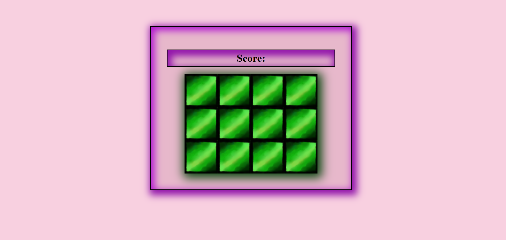
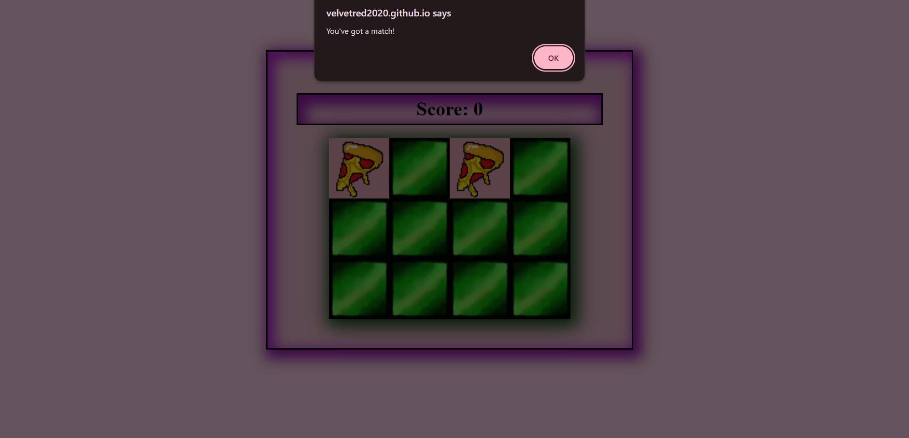
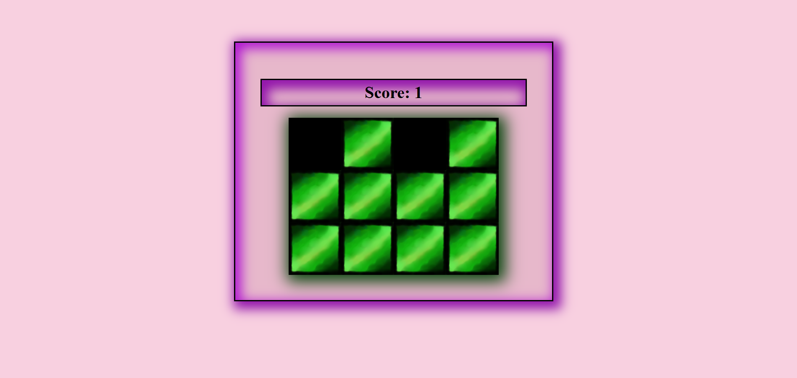
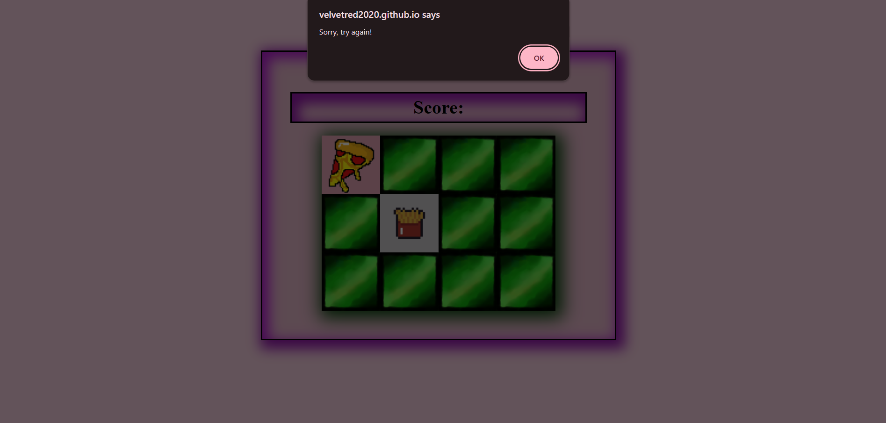
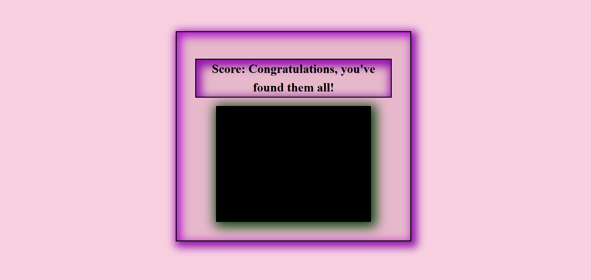

## Memory Game 🧠 https://velvetred2020.github.io/memory_game/

**Memory Game is a simple and engaging image-matching game built with HTML, CSS, and JavaScript. The goal is to match 6 pairs of images (12 cards total) by flipping them two at a time. Each correct match earns you 1 point. Once all cards are matched, you win the game with a celebratory message.**

## 📸 Screenshots
| **Game Start** |
|----------------|
|  |
| **Correct Match Popup** |
|  |
| **Matched Cards Turn Black** |
|  |
| **Wrong Match Popup** |
|  |
| **Winning Message** |
|  |

## ✨ Features

- **Card Matching Game**:
  - Flip two cards to reveal images.
  - Match identical images to score points.
  - Incorrect guesses flip back after a short delay.

- **Interactive Feedback**:
  - Pop-up messages for correct and incorrect matches.
  - Final message when all matches are found.

- **Score Tracking**:
  - Each match earns 1 point.
  - Score updates dynamically as you play.

- **Visual Progress**:
  - All cards start face-down.
  - Matched cards turn black to indicate success.

## 🛠️ Technologies Used

- **HTML**: Structure of the game.
- **CSS**: Styling and layout.
- **JavaScript**: Game logic and interactivity.

## 📋 Prerequisites

To run Memory Game locally, you need:
- A modern web browser (e.g., Chrome, Firefox, Edge).
- Git (optional, for cloning the repository).

## 🚀 Getting Started

You can play the game by clicking the link at the top or here: https://velvetred2020.github.io/memory_game/

To run it locally:

### 1. Clone the Repository
```bash
git clone https://github.com/velvetred2020/memory_game.git
cd memory_game
```
### 2. Open the Game
Just open the `index.html` file in your browser.

### 🖼️ How It Works

**1. Start the Game**  
All cards are face-down.  
Click any two cards to flip them.

**2. Match Logic**  
If the images match, a pop-up says: `"You've got a match!"` and the cards turn black.  
If they don’t match, a pop-up says: `"Sorry, try again!"` and the cards flip back.

**3. Win Condition**  
Once all 6 pairs are matched, a message appears:  
`"Congratulations, you've found them all!"`

### 📂 Project Structure (simplified)
```
memory_game/
|-- index.html              # Main HTML file for the game interface
|-- style.css               # CSS file for styling and layout
|-- app.js                  # JavaScript file containing the core game logic
|-- img/                    # Folder for all game-related images and screenshots
|   |-- cheeseburger.png    # Game card image
|   |-- fries.png           # Game card image
|   |-- hotdog.png          # Game card image
|   |-- ice-cream.png       # Game card image
|   |-- milkshake.png       # Game card image
|   |-- pizza.png           # Game card image
|   |-- blank.png           # Image for the back of an un-flipped card
|   |-- black.png           # Image for a matched/removed card or background
|   |-- memory_view.png     # Screenshot: Initial game view
|   |-- memory_right.png    # Screenshot: Correct match made
|   |-- memory_rightAfter.png # Screenshot: View after correct match is removed/hidden
|   |-- memory_wrong.png    # Screenshot: Incorrect match made
|   |-- memory_win.png      # Screenshot: Game won/completed screen
|-- LICENSE                 # Project license (MIT License)
|-- README.md               # This file
```
### 🔧 Usage Notes

- Works on all modern browsers.  
- No installation required—just open the HTML file.  
- Fully responsive for desktop and mobile.

### 🐞 Troubleshooting

- **Images Not Loading**: Make sure image filenames and paths are correct.  
- **Game Not Starting**: Ensure JavaScript is enabled in your browser.  
- **404 Error on GitHub Pages**: Confirm `index.html` is in the root of the published folder.

### 🌟 Contributing

Contributions are welcome! 🤝

1. Fork the repository.  
2. Create a new branch (`git checkout -b feature/your-feature`).  
3. Commit your changes (`git commit -m "Add your feature"`).  
4. Push to the branch (`git push origin feature/your-feature`).  
5. Open a Pull Request.

**Ideas for contributions:**
- Add difficulty levels or a timer.  
- Include sound effects for matches.  
- Add animations or card flip transitions.

### 📜 License

This project is licensed under the MIT License. See the LICENSE file for details.

### 👐 Acknowledgments

- Inspired by classic memory games.  
- Thanks to the open-source community for creative inspiration.

Made with 💻 and ☕ by Elena (@Velvetred2020). Give it a ⭐ if you enjoyed playing!


